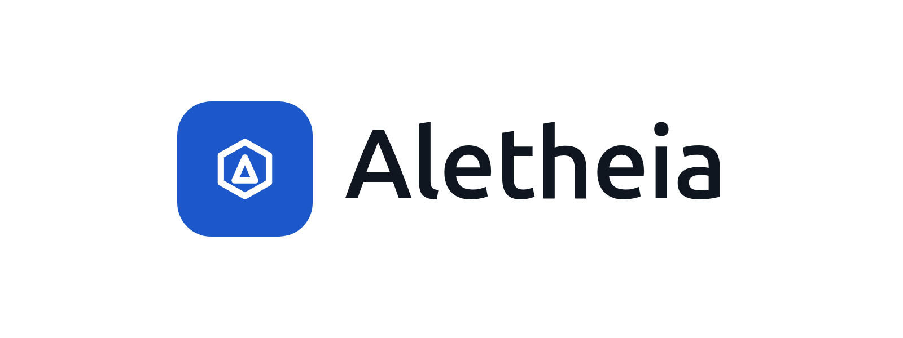
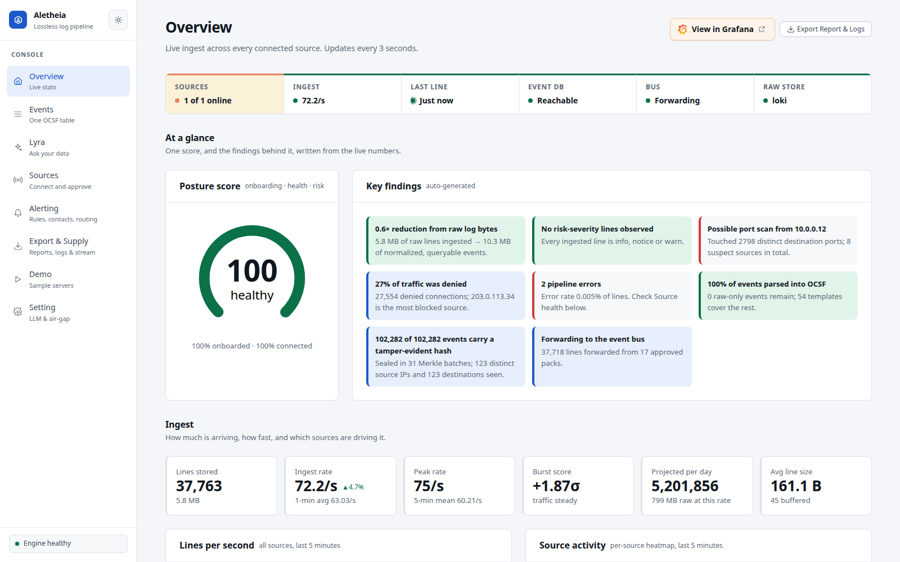

<div align="center">

<picture>
  <source media="(prefers-color-scheme: dark)" srcset="docs/assets/aletheia-logo-dark.png">
  
</picture>

### Universal Lossless Log Pre-processing Framework

**Normalize everything. Lose nothing. Prove it.**

[](LICENSE)
[](#requirement-traceability)
[](SETUP.md#1-docker-recommended)
[](backend/engine)
[](backend/studio)
[](frontend)
[](https://schema.ocsf.io)
[](SETUP.md#air-gapped-machines)

[Quick start](#quick-start) ·
[Setup guide](SETUP.md) ·
[Evaluation guide](#guided-evaluation) ·
[Architecture](docs/architecture.md) ·
[Documentation](#documentation)

</div>

---

Aletheia turns any perimeter-device log (any vendor, format or firmware) into a standard
**[OCSF](https://schema.ocsf.io)** event **without losing a single byte of the original**, and it can
prove that for every event.

Built by **Team ORCA#26** for **Smart India Hackathon 2026, Problem Statement 26156**.

## Quick start

You only need Docker (4+ cores, **8 GB RAM for Docker**, 10 GB disk). One command starts the whole
pipeline:

```bash
docker run -d --name aletheia -p 6156:6156 -p 26514:5514/udp -p 26514:5514/tcp -v aletheia-data:/data --add-host=host.docker.internal:host-gateway <docker-repo>/aletheia:1.0.0
```

After one to two minutes, `docker ps` shows the container as **healthy**. Then open:

| | |
| :--- | :--- |
| **Aletheia** | <http://localhost:6156> |
| **Demo Console** (start here) | <http://localhost:6156/dashboard/demo> |
| **Grafana** (admin / `aletheia`) | <http://localhost:6156/grafana/> |
| **Syslog input** for your own logs | `localhost:26514` UDP/TCP |

> [!NOTE]
> `<docker-repo>` is a placeholder until the registry URL is published. **[SETUP.md](SETUP.md)** has
> the full installation guide: Docker, Linux / macOS and Windows from source, air-gapped install,
> ports and troubleshooting.

After installing, optionally [connect an AI provider](#connect-an-ai-provider) and follow the
[guided evaluation](#guided-evaluation).

<p align="center">
  
</p>

## Contents

- [Why Aletheia](#why-aletheia)
- [How it works](#how-it-works)
- [Connect an AI provider](#connect-an-ai-provider)
- [Guided evaluation](#guided-evaluation)
- [Features](#features)
- [Configuration](#configuration)
- [Command-line tools](#command-line-tools)
- [Development](#development)
- [Project structure](#project-structure)
- [Documentation](#documentation)
- [Benchmarks and limitations](#benchmarks-and-limitations)
- [Troubleshooting](#troubleshooting)
- [Requirement traceability](#requirement-traceability)

## Why Aletheia

Security teams hand-write a parser for every vendor, lose fields when they normalize, and cannot
show which bytes a value came from. Aletheia learns a **template** for each log format and stores
each event as *template + variable values*. That one representation does three jobs:

| | |
| :--- | :--- |
| **Normalization** | Every variable slot has a meaning, so it maps to an OCSF field |
| **Compression** | The literal text is stored once per template, not once per event |
| **Reconstruction** | Literals + variables rebuild the original line byte for byte |

Each reconstruction is checked against a SHA-256 taken on arrival, and those hashes are sealed into a
per-minute **Merkle chain**, so any later change to stored data is detectable.

## How it works

1. **Receive and hash.** Logs arrive exactly as sent; the raw bytes are hashed and written to the bus
   **before** anything is parsed.
2. **Match, rebuild, verify, normalize.** A worker matches a compiled template, extracts typed
   variables, **rebuilds the original and checks the hash**, then maps the event to OCSF.
3. **Never drop.** Anything that does not match is stored verbatim and queued for onboarding, where
   the Studio derives a new template behind a byte-exact gate, a replay diff and human approval.

```
devices ──▶ Vector ──▶ Redpanda (raw) ──▶ Go worker ──▶ ClickHouse · Loki · Kafka · HEC · CEF
                                              │  hash → envelope → match
                                              │  → reconstruct + verify → OCSF
                                              └──▶ quarantine ──▶ Onboarding Studio ──▶ gated parser pack
```

Inside the Docker image one nginx port (6156) serves the UI, the Studio API (`/api/`) and Grafana
(`/grafana/`). Every datastore is internal to the container. The full design is in
[docs/architecture.md](docs/architecture.md).

## Connect an AI provider

**Optional.** Aletheia works fully without AI: templates are always derived deterministically and
heuristic rules map the fields. With a provider, onboarding asks the model to map each new format
(one request per format, never per event), and **Lyra**, the chat assistant, answers questions over
your data. The AI never sees a live event, and every mapping it proposes must still pass the
byte-exact gate, the replay diff and human approval. The image ships **no model weights**.

| Provider | You need | Data leaves the machine? | Air-gap |
| :--- | :--- | :--- | :--- |
| **None** (default) | nothing | no | yes |
| **Google Gemini** | a Gemini API key | masked samples only | no |
| **Local model** | a model server you run (Ollama, llama.cpp, vLLM, LM Studio) | only to that server | yes |

Everything is set in **Settings**: <http://localhost:6156/dashboard/settings> in Docker, or
<http://localhost:5173/dashboard/settings> when running from source. Settings are stored encrypted
(AES-GCM) in PostgreSQL and apply immediately. In Docker they persist only with `-v aletheia-data:/data`.

### Google Gemini (cloud)

1. Create a free API key at **<https://aistudio.google.com/api-keys>**.
2. In **Settings**, click the **Gemini** card, read the privacy notice and press **OK**.
3. Paste the key and press **Save & Test Connection**. *Connection successful & tested!* means it works.

Samples are **masked** before they are sent: values become format-preserving placeholders, so an IP
still looks like an IP. The model is `gemini-3.5-flash-lite`; only `gemini-*` models are accepted.

### Local model with Ollama (private, works air-gapped)

1. Install Ollama from **<https://ollama.com/download>** and pull a model:

   ```bash
   ollama pull llama3.2:1b          # small and fast, the Settings default
   ollama pull qwen2.5-coder:7b     # better mappings; about 5-8 GB RAM at 4-bit
   ```

2. **Docker on Linux only:** Ollama listens on `127.0.0.1`, which a container cannot reach. Run
   `sudo systemctl edit ollama`, add `Environment="OLLAMA_HOST=0.0.0.0"` under `[Service]`, then
   `sudo systemctl restart ollama`. Restrict port 11434 with your firewall. Docker Desktop on Windows
   and macOS needs no change.
3. In **Settings**, click **Local model**, choose the **Ollama** preset and set the base URL:

   | Running Aletheia | Base URL |
   | :--- | :--- |
   | From source | `http://localhost:11434/api/chat` |
   | In Docker | `http://host.docker.internal:11434/api/chat` |

   Inside a container `localhost` is the container itself, hence `host.docker.internal`.
4. Enter the model name exactly as `ollama list` prints it and press **Save & Test Connection**.

Other servers use the same card: llama.cpp `http://localhost:8080`, LM Studio
`http://localhost:1234/v1`, vLLM `http://localhost:8000/v1` (use `host.docker.internal` from Docker).

### Configuring AI without the UI

Copy `deploy/secrets/aletheia.env.example` to `deploy/secrets/aletheia.env` (gitignored) and set the
key. `make studio` / `make dev` read it automatically; for Docker, pass `--env-file
deploy/secrets/aletheia.env`. A mounted key file is safer than `-e`, which shows in `docker inspect`:

```bash
-v ./llm.key:/run/secrets/llm_key:ro -e ALETHEIA_LLM_API_KEY_FILE=/run/secrets/llm_key
```

Precedence is **Settings > environment > default**. `ALETHEIA_LLM_SEND_SAMPLES` controls what a
provider receives: `masked` (default), `none` (template and slot types only) or `raw` (refused for
cloud providers). `ALETHEIA_AIRGAP=true` refuses Gemini outright. Measured provider behaviour:
[docs/llm-provider-notes.md](docs/llm-provider-notes.md).

## Guided evaluation

Open the **Demo Console** (<http://localhost:6156/dashboard/demo>) and run the scenarios in order.
Each card states what it proves, what success looks like, and the equivalent CLI command.

| # | Scenario | Requirement |
| :--- | :--- | :--- |
| 0 | One-command start | k |
| 1 | Unified output: eight source types, one OCSF table | b, c, f |
| 2 | **Byte lineage**: click `src_endpoint.ip` and the exact source bytes highlight | d |
| 3 | **Integrity**: verify passes, tamper one stored byte, verify fails at that exact event | a |
| 4 | Storage economy: live comparison against raw + normalized copies | economy |
| 5 | Drift and gated onboarding | e, i |
| 5b | Gate rejection: a faulty template is refused at a named byte offset | safety |
| 5c | AI-assisted proposal (optional) | AI useful, never trusted blindly |
| 6 | Replay diff, approval, hot reload, backfill | safe plug-and-play |
| 7 | Reach: the same events in Loki, Kafka and a CEF re-emit | g |
| 8 | Throughput on your own machine | scalability |
| 9 | Air-gapped operation | j |
| 10 | Bring your own log | any source |

**Bring your own log.** Send any line to the syslog port:

```bash
logger --server localhost --port 26514 --udp "<your log line>"
echo "<your log line>" | nc -u -w1 localhost 26514
```

A known format normalizes immediately. An unknown one is never dropped: it is stored verbatim and
grouped into quarantine clusters (`/api/v1/studio/clusters`), ready to be onboarded as a source on the
**Sources** page.

**Prove the air-gap claim.** Install the image on a machine with no network (see
[SETUP.md](SETUP.md#air-gapped-machines)), or block all egress at the host firewall, then run every
scenario. All must pass. Do not use `--network none`: it also blocks the UI port. In a packet capture
from first boot through every feature, the image made no outbound connections and no DNS lookups.

## Features

| Area | What you get |
| :--- | :--- |
| **Lossless pipeline** | Hash before parse, byte-exact reconstruction on every event, verbatim fallback, per-minute Merkle chain, `aletheia verify` |
| **Onboarding Studio** | Quarantine → Drain3 clustering → exact template → gate → replay diff → human approval → hot reload with no restart |
| **One schema** | OCSF (pinned) with typed columns; unmapped fields kept, never discarded |
| **Dashboard** | Overview with posture score and findings, Events explorer, byte-level Lineage, Sources, Export, Alerting, Demo Console, Settings |
| **Lyra assistant** | Chat over your data through read-only, allow-listed SQL; every query audit-logged; sessions exportable |
| **Alerting** | Rules, contact points and notification policies edited in Aletheia, evaluated by Grafana ([docs/alerting.md](docs/alerting.md)) |
| **Integrations** | ClickHouse, Loki, Kafka topic `normalized`, Splunk HEC, CEF/LEEF/syslog re-emit, TCP supply stream, Parquet |
| **Export** | Logs as JSON, JSONL, CSV, TSV, text, RFC 5424, CEF, LEEF or XML; reports as PDF, HTML, Markdown, CSV or JSON |
| **Deployment** | One multi-arch image (amd64 + arm64), one HTTP port, nothing fetched at run time |

### Lyra, the data assistant

Lyra (`/dashboard/lyra`) answers ad-hoc questions about events, sources and parser packs by running
read-only SQL against ClickHouse. Every query passes an allow-list of tables, columns, functions and
keywords (`SELECT *` is refused) and runs with `readonly=1` and resource caps. The model uses the tools
`run_sql`, `list_sources`, `list_packs` and `final`, up to five steps per turn, streamed over SSE.
Sessions are saved and export as PDF, Markdown, JSON or text. Lyra needs an AI provider; it never
writes, deletes or changes settings.

### Export and supply

The **Export** page downloads raw lines, OCSF events or the audit trail, and builds reports. The
**supply stream** feeds a SIEM or collector over TCP (`raw`, `tagged`, `json`, `syslog`, `cef` or
`ocsf`), either listening on `127.0.0.1:9099` (optional IP/CIDR allowlist) or pushing to a
collector. Raw lines are always carried whole, so a receiver can re-check the SHA-256.

## Configuration

All state lives under `/data` in the container. Without `-v aletheia-data:/data`, every `docker run`
starts a fresh demo.

| Variable | Default | Effect |
| :--- | :--- | :--- |
| `ALETHEIA_DEMO_AUTOSTART` | `true` | Start demo traffic once healthy |
| `ALETHEIA_DEMO_RATE` | `200` | Demo events per second |
| `ALETHEIA_WORKERS` | `2` | Worker processes in the container |
| `ALETHEIA_ADMIN_PASSWORD` | `aletheia` | Grafana admin password |
| `ALETHEIA_AIRGAP` | `false` | `true` refuses all cloud AI providers |
| `ALETHEIA_SECRET` | generated on first start | AES-GCM key for settings stored via the UI |
| `ALETHEIA_PUBLIC_URL` | `http://localhost:6156` | Browser-facing origin, used in links Grafana writes (alert emails) |
| `ALETHEIA_GRAFANA_PUBLIC_URL` | `/grafana` | Grafana as the browser reaches it; relative, so it works on any host or port |
| `ALETHEIA_SMTP_ENABLED` / `_HOST` / `_USER` / `_PASSWORD` / `_FROM_ADDRESS` | off | Grafana SMTP for email alerts ([docs/alerting.md](docs/alerting.md)) |
| `ALETHEIA_SUPPLY_ENABLED` / `_HOST` / `_PORT` / `_FORMAT` / `_MODE` / `_TARGET` / `_ALLOW` | off | Supply stream defaults; normally set on the Export page |
| `ALETHEIA_HEC_ENDPOINT` / `_TOKEN` / `_INDEX` | unset (off) | Splunk HEC fan-out, e.g. `http://splunk:8088`; the sink is loaded only when set |
| `ALETHEIA_CEF_SYSLOG_ADDR` | unset (off) | CEF re-emit over TCP syslog, e.g. `siem:514`; the sink is loaded only when set |

AI provider variables, also read from `deploy/secrets/aletheia.env` when running from source:

| Variable | Default | Effect |
| :--- | :--- | :--- |
| `ALETHEIA_LLM_PROVIDER` | `none` (image) · `gemini` (example file) | `none`, `gemini` or `local` |
| `ALETHEIA_LLM_MODEL` | `gemini-3.5-flash-lite` | On `gemini`, only `gemini-*` models are accepted |
| `ALETHEIA_LLM_API_KEY` / `_FILE` | empty | Gemini key, inline or from a mounted file (preferred) |
| `ALETHEIA_LLM_BASE_URL` | `http://localhost:11434/v1` | For `local`; use `host.docker.internal` from Docker |
| `ALETHEIA_LLM_SEND_SAMPLES` | `masked` | `masked`, `none` or `raw` (local providers only) |

## Command-line tools

```bash
docker exec aletheia aletheia verify    --source fw01 --last 15m
docker exec aletheia aletheia replay    --source fw01 --from-version 4 --to-version 5 --last 5000
docker exec aletheia aletheia test-pack --pack /opt/aletheia/packs/cisco_asa.yaml --samples /opt/aletheia/packs/tests
docker exec aletheia aletheia bench     --workers 1,2,4 --duration 60s
```

Every command accepts `--json` and prints a single JSON object.

## Development

Installing from source on Linux, macOS or Windows is covered in [SETUP.md](SETUP.md). The everyday
loop on Linux and macOS:

```bash
make check      # offline: parser packs + engine + studio + frontend tests
make dev        # datastores in Docker; engine worker, Studio and frontend natively with hot reload
make help       # every target
```

**Prove the core claim with nothing running.** `make lite` parses every golden sample, rebuilds it
from template + variables and checks it byte for byte. Two independent implementations, the Go engine
and a Python reference verifier, must agree:

```
pack                    tmpl  samples   recon   norm   fail
cef_generic                4        5       5      5      0
cisco_asa                  8       11      11     11      0
fortigate                  3        5       5      5      0
leef_generic               3        3       3      3      0
llm_training               1        1       1      1      0
openvpn                    2        2       2      2      0
pfsense_filterlog          4        4       4      4      0
squid_access               1        1       1      1      0
suricata_eve               1        1       1      1      0
TOTAL                     27       33      33     33      0
```

**Production mode and images.** `docker compose -f deploy/docker-compose.yml up -d` runs one
container per component, with workers scaled by replica count. `./docker/build.sh` builds and
verifies the all-in-one image; pinned upstream versions are in
[docker/allinone/Dockerfile](docker/allinone/Dockerfile).

## Project structure

```
backend/engine     Go: the deterministic hot path (worker, sealer) and the aletheia CLI
backend/studio     Python FastAPI: clustering, derivation, gate, replay diff, LLM adapters
  ├─ api           REST endpoints: chat, stats, sources, samples, export, alerting, settings
  ├─ chat          Lyra agent, SQL guard, session store
  ├─ ingest        connectors, onboarding, supply stream, export wire formats
  └─ alerting      Grafana-backed rules, contact points, notification policies
backend/packs      parser packs + golden samples
backend/ocsf       pinned OCSF subset and validator
frontend           React + Vite + TypeScript UI (landing page and dashboard)
deploy             Compose files, Vector, Redpanda, ClickHouse, Postgres, Loki, Grafana, Prometheus
docker             all-in-one image (s6-overlay + nginx) and per-component images
sources            seeded log generators and corpora
bench              benchmark harness
docs               design, contracts, alerting, benchmarks
```

## Documentation

| Document | What it covers |
| :--- | :--- |
| [SETUP.md](SETUP.md) | Installation: Docker, Linux / macOS, Windows, air-gapped, ports, troubleshooting |
| [docs/architecture.md](docs/architecture.md) | Two-page architecture: components, data flow, integrity model, deployment |
| [docs/technical-specification.md](docs/technical-specification.md) | The complete design: algorithms, formats, trade-offs and limitations |
| [docs/CONTRACTS.md](docs/CONTRACTS.md) | Frozen interfaces between components: bus topics, schemas, APIs, environment |
| [docs/alerting.md](docs/alerting.md) | Alert rules, contact points, policies and the Grafana dashboards |
| [docs/benchmarks.md](docs/benchmarks.md) | Measured throughput and storage, with the method to reproduce them |
| [docs/llm-provider-notes.md](docs/llm-provider-notes.md) | Measured behaviour of Gemini and local model servers |

An index with suggested reading order is in [docs/README.md](docs/README.md).

## Benchmarks and limitations

Every figure in [docs/benchmarks.md](docs/benchmarks.md) is measured by the harness in
[bench/](bench/) and recorded with its machine specification. On one worker the engine processes
**19,329 events/s** (46,040 on eight, i7-1360P). Known limitations, stated plainly:

- JSON and XML are fully normalized but stored **verbatim** by default; the compression benefit is
  mainly for syslog, CEF, LEEF, KV and CSV.
- **Reconstruction proves no loss, not correct meaning.** A template can rebuild perfectly while a
  mapping points at the wrong OCSF field. Golden tests, replay diff and human review cover that.
- The Merkle chain proves stored data has not changed since sealing, not that a device logged the truth.
- Vendor formats in the prototype are generated from published vendor documentation, not captured
  from real devices.
- UDP syslog can lose packets before they reach Aletheia; prefer TCP or TLS.

The full list is in the [technical specification](docs/technical-specification.md), §25.

## Troubleshooting

Installation problems (memory, ports, line endings) are covered in
[SETUP.md](SETUP.md#5-troubleshooting).

| Symptom | Fix |
| :--- | :--- |
| Settings and AI key gone after a restart | The container ran without `-v aletheia-data:/data`. Recreate it with the volume and save the key again |
| Local model: *Connection failed* from Docker | Use `http://host.docker.internal:11434/api/chat`, not `localhost`. On Linux, Ollama needs `OLLAMA_HOST=0.0.0.0` |
| Gemini: *Connection failed* | Check the key, internet access, and that `ALETHEIA_AIRGAP` is not `true` |
| Settings rejects the model | The `gemini` provider accepts only `gemini-*` models |
| "AI suggestion unavailable" | Expected fallback: heuristic proposals still work. Check the connection in Settings |
| Sidebar shows *Pack check failed* | The parser-pack self-test failed. Open `/api/v1/packs/verify` for the reason |
| Sources added by `make seed` do not appear | Studio loads sources at startup. Run `make seed` before `make dev`, or restart Studio |
| Alerts fire in Grafana but never reach the browser (from source) | A firewall blocks Grafana → Studio; see [docs/alerting.md](docs/alerting.md#troubleshooting) |

## Requirement traceability

| Requirement (PS 26156) | How Aletheia meets it |
| :--- | :--- |
| **a.** Preserve raw data without loss | Raw bytes hashed and committed to the bus before parsing; stored as a verified template or verbatim; never dropped; `aletheia verify` |
| **b.** Extract source attributes | Templates capture every variable; unmapped slots kept in `unmapped` |
| **c.** Normalize to a taxonomy | OCSF, pinned version, typed columns |
| **d.** Traceability | `event_uid`, `raw_sha256`, pack version, **byte-level lineage** |
| **e.** Plug-and-play onboarding | Parser packs, Onboarding Studio, hot reload with no restart |
| **f.** Unified visibility | One schema across all sources in ClickHouse, Grafana and Loki |
| **g.** SIEM / data-lake integration | Kafka topic `normalized`, Splunk HEC, CEF re-emit, Loki, Parquet |
| **h.** AI/ML ready | Typed OCSF columns in ClickHouse, queryable with SQL or from Grafana |
| **i.** Reduced parser effort | Automatic template derivation, slot typing, mapping proposals |
| **j.** Air-gapped | `docker save` / `load`, nothing fetched at run time, telemetry off, AI optional |
| **k.** Containerized | All-in-one multi-arch image; per-component images with Docker Compose |

## License

Released under the [MIT License](LICENSE). © 2026 Team ORCA#26.
