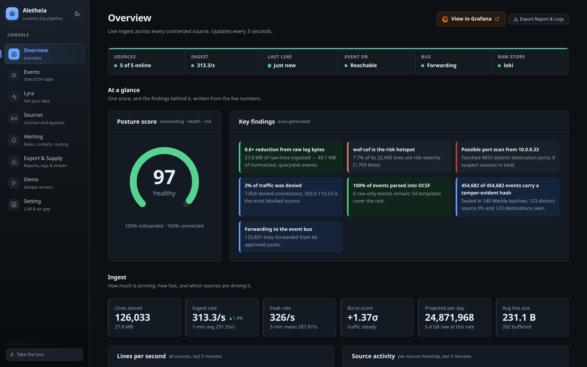
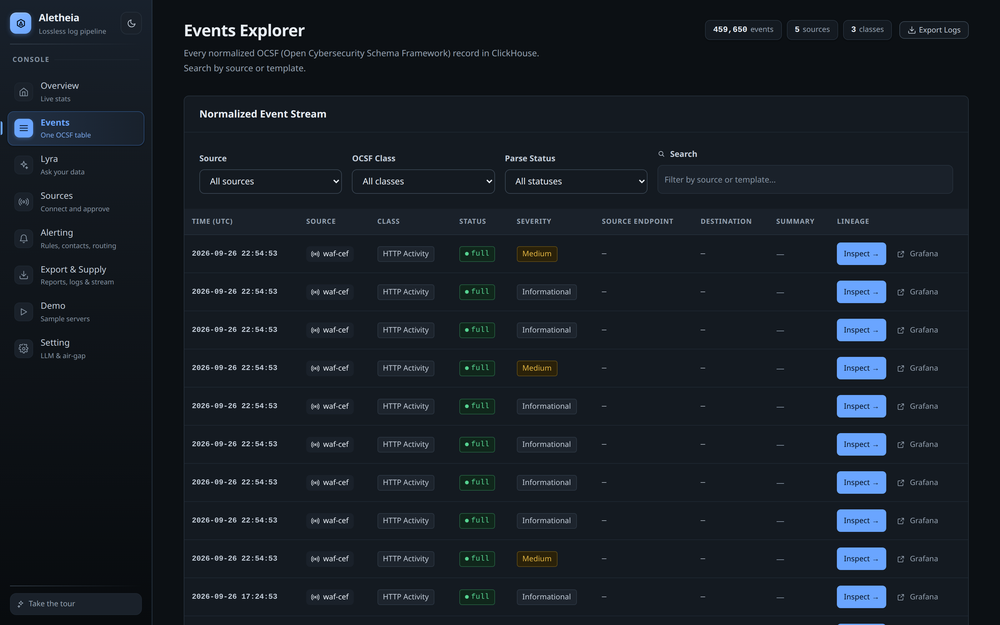
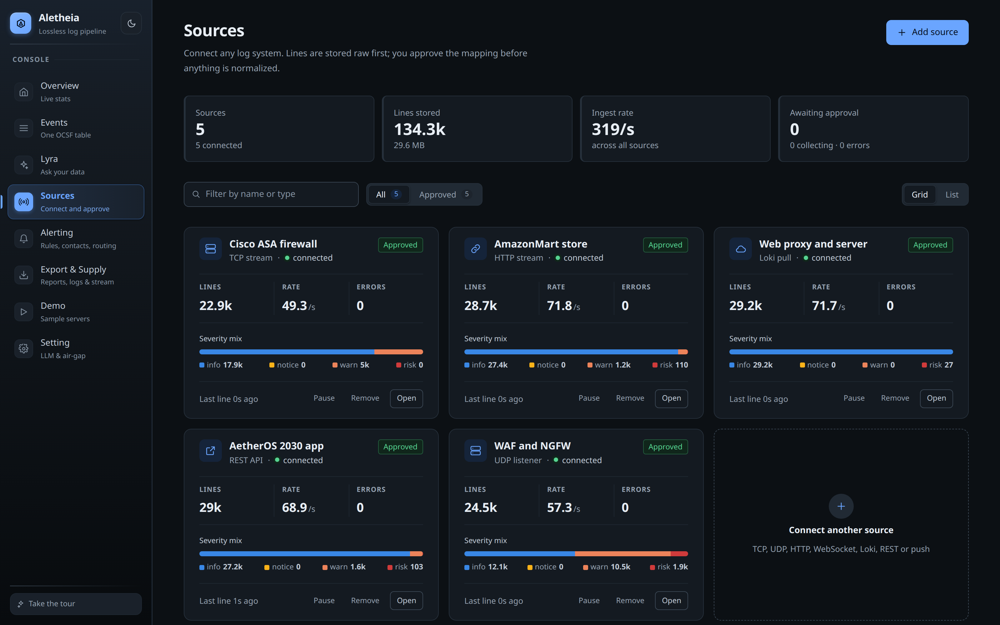
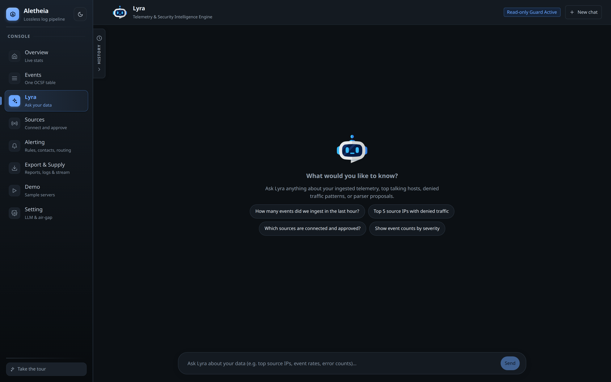
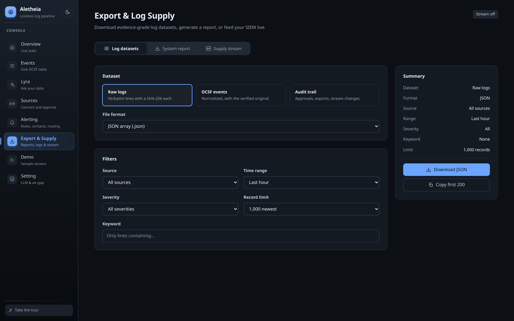
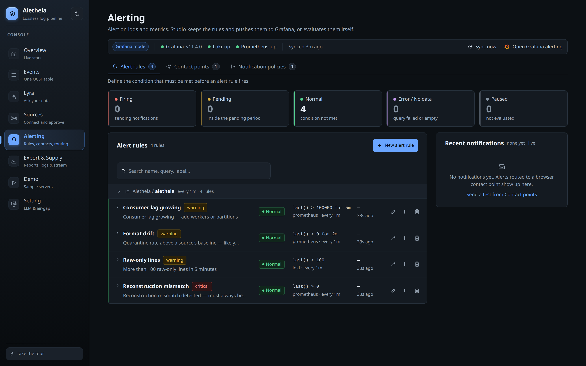
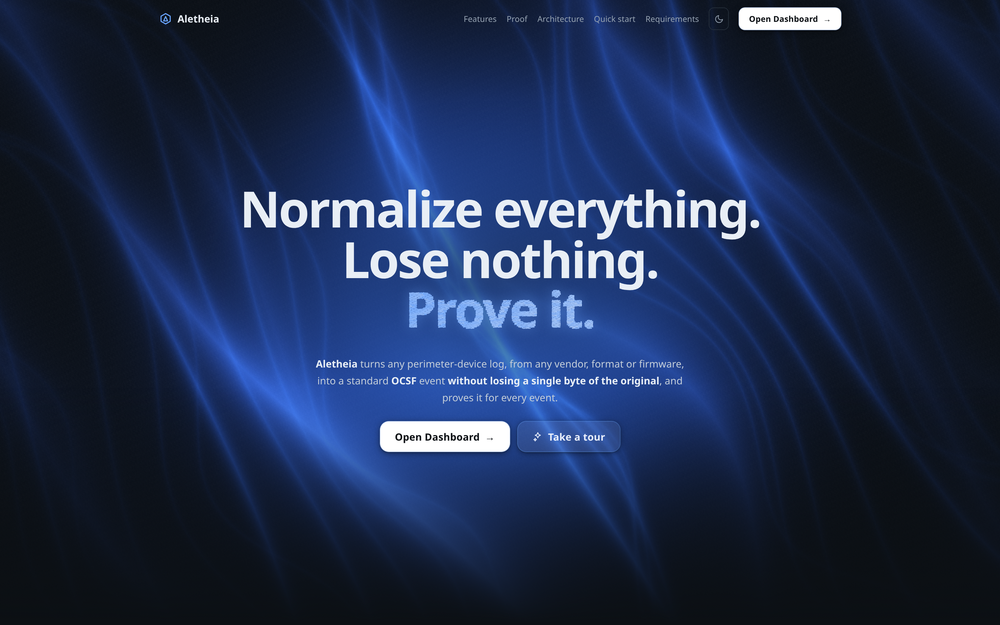
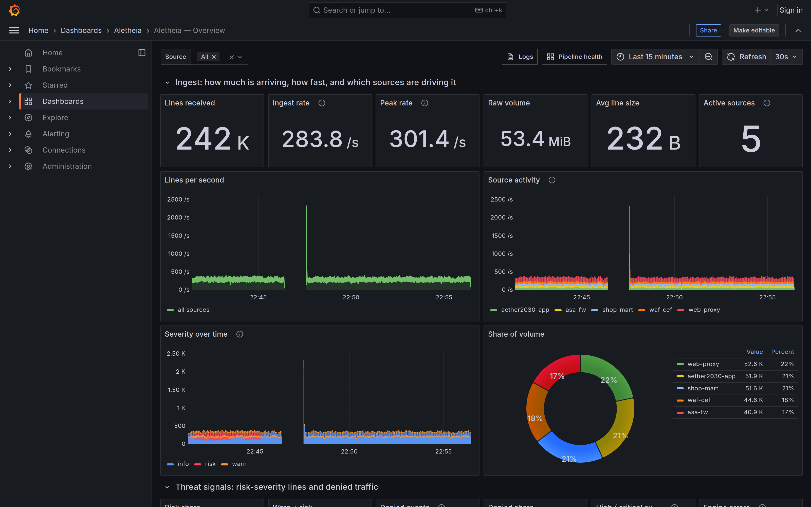
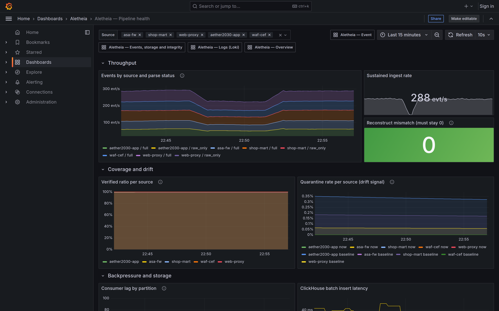
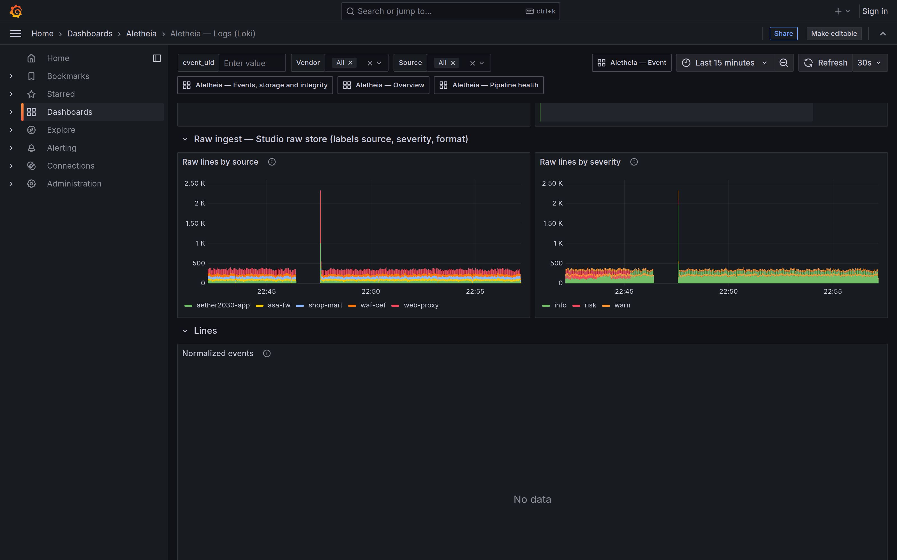

# Screenshots

Captured from a live local stack: five sources connected and approved across five transports
(TCP, HTTP NDJSON, Loki pull, REST cursor, UDP syslog), ~290 lines/s, zero ingest errors,
100% of events parsed into OCSF, posture score 97. All 3200x2000 (1600x1000 at 2x), dark theme.

The README's own screenshot is `docs/assets/dashboard-overview.png` (light theme, 1600x1000).

---

## Studio

### 01. Overview

Posture score, auto-written findings and live ingest KPIs.

### 02. Events Explorer

Normalized OCSF records, each traceable back to its raw line.

### 03. Sources

Five transports at once, each with its own severity mix and error count.

### 04. Lyra

Ask-your-data console with the read-only guard active.

### 05. Export & Supply

Evidence-grade datasets, generated reports and the live SIEM feed.

### 06. Alerting

Grafana-synced rules with health and state at a glance.

### 07. Landing

Hero statement over the animated fiber field.

---

## Grafana

### 08. Overview

Ingest rate, per-source activity, severity over time and share of volume.

### 09. Pipeline health

Reconstruct mismatch holding at 0 beside sustained throughput.

### 10. Logs (Loki)

Raw ingest by source and by severity, straight from the raw store.

